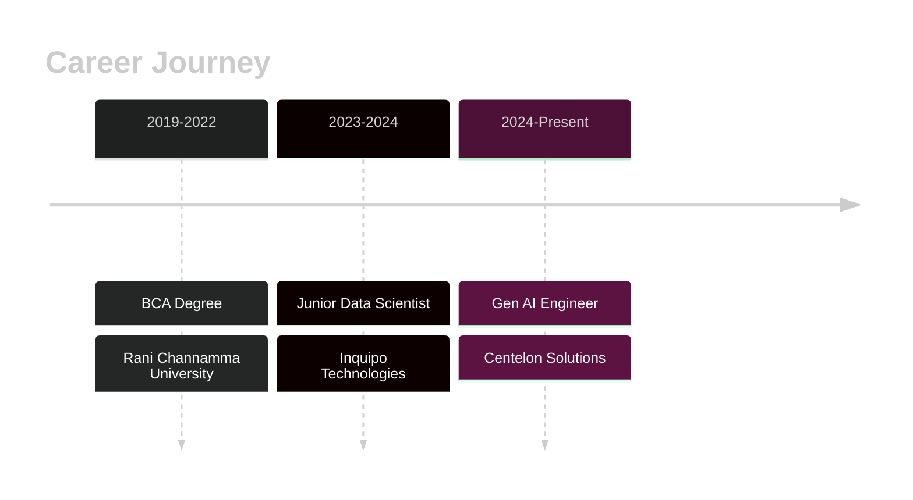

<div align="center">

# 🚀 Vijay Konakeri

### AI Engineer | Building Intelligent Systems with LLMs & Gen AI

[](https://vijaykonakeri.dev)
[](https://linkedin.com/in/vijay-konakeri)
[](https://github.com/Vijay-konakeri)
[](https://medium.com/@vijay.bk698)
[](mailto:vijay.bk698@gmail.com)


</div>

---

## 💫 About Me

```python
class VijayKonakeri:
    def __init__(self):
        self.role = "Gen AI/ML Engineer @ Centelon Solutions"
        self.location = "Bangalore 🇮🇳"
        self.expertise = ["LLMs", "RAG Systems", "Multi-Agent AI"]
        self.experience = "2+ years"
        
    def current_focus(self):
        return [
            "🤖 Building production-grade LLM applications",
            "🎯 Architecting RAG pipelines with 85%+ accuracy",
            "⚡ Fine-tuning models with LoRA/PEFT",
            "☁️ Deploying scalable AI on AWS & Azure"
        ]
    
    def achievements(self):
        return {
            "productivity_boost": "35% faster dev time with AI assistant",
            "documents_indexed": "4000+ enterprise docs",
            "developers_impacted": "50+ engineers",
            "retrieval_accuracy": "85%+"
        }
```

---

## 🛠️ Tech Stack

<div align="center">

### 🤖 AI & ML


### 🗄️ Vector & Databases


### ☁️ Cloud & DevOps


### 🌐 Web & Frameworks


</div>

---

## 🏆 Featured Projects

<div align="center">

| 🚀 Project | 💡 Description | 🛠️ Tech |
|------------|----------------|----------|
| **AI Code Assistant** | VS Code extension reducing dev time by 35% | GPT-4o, Azure, TypeScript |
| **RAG Pipeline** | 85%+ accuracy across 4K+ documents | Pinecone, LangChain, OpenAI |
| **RFP Assistant** | Automated proposal generation system | GPT-4, Flask, python-pptx |
| **SDG Tool** | Synthetic data generator for testing | Python, Hugging Face |

</div>

---

## 📊 Experience Timeline

<div align="center">



</div>

---

## 🎯 Certifications

<div align="center">

🏅 **Oracle Certified Professional** - Generative AI  
🏅 **Generative AI with LLMs** - Coursera  
🏅 **Deep Learning & AI** - Udemy  
🏅 **Data Analytics** - LinkedIn

</div>

---

## 📈 GitHub Activity

<div align="center">


</div>

---

## 🔥 Current Focus

<div align="center">

🎯 **Prompt Engineering** • 🤖 **Multi-Agent Systems** • 🔍 **Advanced RAG**  
⚡ **Model Fine-tuning** • ☁️ **LLMOps** • 🚀 **Scalable AI APIs**

</div>

---

## 📫 Let's Connect!

<div align="center">

**💬 Open for:** Collaborations • Freelance • AI Consulting • Tech Talks

[](https://linkedin.com/in/vijay-konakeri)
[](mailto:vijay.bk698@gmail.com)
[](https://twitter.com/vijaykonakeri)

---

### ⚡ *"Building the future with AI, one model at a time"* ⚡


</div>
