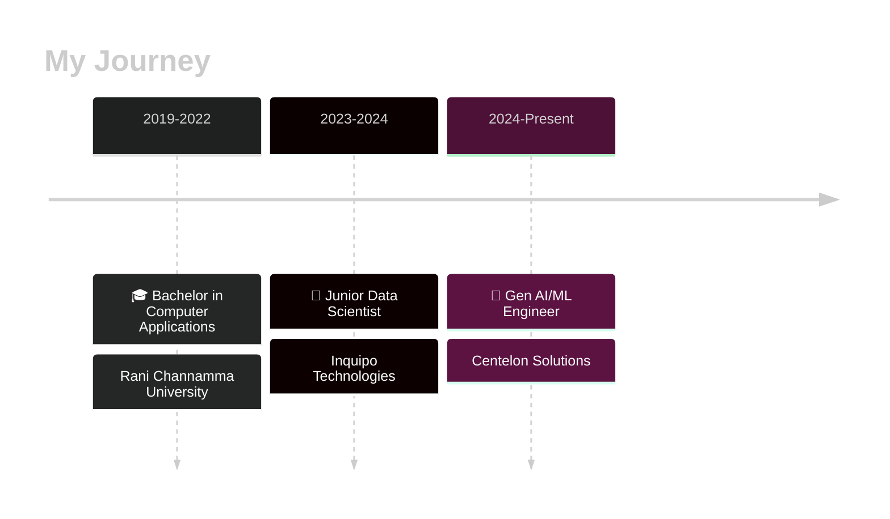

# Vijay Konakeri

### AI Engineer | Building Intelligent Systems with LLMs & Gen AI

---

## 💫 About Me

### ✨ *Transforming Ideas into Intelligent Solutions* ✨

I'm a **passionate AI Engineer** with **2+ years** of hands-on experience crafting production-grade **Generative AI solutions**. Currently working at **Centelon Solutions** in Bangalore, I specialize in building intelligent systems that make a real difference.

My journey in AI is driven by curiosity and innovation. I love exploring the endless possibilities of **Large Language Models**, architecting sophisticated **RAG pipelines**, and creating **multi-agent systems** that solve complex real-world challenges. Whether it's fine-tuning models with LoRA/PEFT or deploying scalable AI solutions on cloud platforms, I thrive on pushing the boundaries of what's possible.

---

## 📚 Experience Timeline

---

### 🎯 What I Do Best

<table align="center">
<tr>
<td align="center" width="33%">

 <b>🤖 Gen AI Development</b>
 Building LLM applications with GPT-4, Llama-2, and Mistral
</td>
<td align="center" width="33%">

 <b>🔍 RAG Systems</b>
 Architecting pipelines with 85%+ accuracy using Pinecone & ChromaDB
</td>
<td align="center" width="33%">

 <b>☁️ Cloud Deployment</b>
 Scalable AI solutions on AWS SageMaker & Azure
</td>
</tr>
<tr>
<td align="center" width="33%">

 <b>⚡ Model Fine-tuning</b>
 Optimizing LLMs with LoRA/PEFT techniques
</td>
<td align="center" width="33%">

 <b>🚀 API Development</b>
 Building robust inference APIs with Flask & FastAPI
</td>
<td align="center" width="33%">

 <b>📚 Mentorship</b>
 Guiding teams in prompt engineering & LLMOps
</td>
</tr>
</table>

### 🌟 My Impact

 

**35%** reduction in development time  •  **85%+** retrieval accuracy  •  **4000+** documents indexed  •  **50+** developers empowered

Beyond coding, I'm passionate about **sharing knowledge**. You'll find me writing technical articles on Medium, contributing to open-source, and staying ahead of the curve with the latest in LLMs and GenAI. I believe in continuous learning and collaborative innovation—because the best solutions emerge when great minds work together.

---

## 🛠️ Tech Stack

### 🤖 AI & Machine Learning

### 🗄️ Vector Databases & Search

### ☁️ Cloud & DevOps

### 🌐 Web Development & Frameworks

### 📊 Data Science & Analytics

## 🎯 Certifications & Achievements

| 🏅 Certification | 🏛️ Organization |
|:---------------:|:---------------:|
| **Oracle Certified Professional - Generative AI** | Oracle |
| **Generative AI with Large Language Models** | Coursera |
| **Deep Learning and Artificial Intelligence** | Udemy |
| **Data Analytics Professional Certificate** | LinkedIn |

---

## 🔥 Current Focus

**Exploring:** Prompt Engineering • Multi-Agent Systems • Advanced RAG Architectures  
**Building:** Scalable LLM Applications • Vector Search Solutions • AI-Powered Tools  
**Learning:** Latest LLM Techniques • LLMOps Best Practices • Cloud-Native AI

---

## 📫 Let's Connect!

### 💬 *I'm always excited to collaborate on innovative AI projects!*

**Open for:** AI Collaborations • Freelance Opportunities • Tech Consulting • Speaking Engagements

 

 

### ⚡ *"Building the future with AI, one model at a time"* ⚡

 

